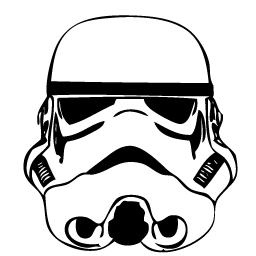

# FSJS_Techdegree_project4
 OOP Gaem Show App

/**
* Changes made for Star Wars Theme:
*/

// Included star wars font

@font-face {
    font-family: 'SF Distant Galaxy Regular';
    font-style: normal;
    font-weight: normal;
    src: local('SF Distant Galaxy Regular'), url('/fonts/SFDistantGalaxy.ttf');
}

// Made changes to the font, background colors, text and font colors to make it a star wars theme

/* main */

* {
  font-family: 'SF Distant Galaxy Regular', 'Montserrat', sans-serif;
}

body {
  background-color: #000000;
}

h1 {
  font-size: 30px;
  max-width: 70%;
  margin: 3% auto;
}

/* Title */

.header {
  color: #FFE81F;
}

/* Overlay */

.title {
  color: #FFE81F;

.win {
  background-image: url("/images/rebelBackground.png");
  background-size: 10%;
  background-color: var(--color-win);
}

.lose {
  background-image: url("/images/empireBackground.png");
  background-size: 10%;
  background-color: #f5785f;
}

// Changed heart.png to a stormtrooper image

  <ol>
    <li class="tries"></li>
    <li class="tries"></li>
    <li class="tries"></li>
    <li class="tries"></li>
    <li class="tries"></li>
  </ol>